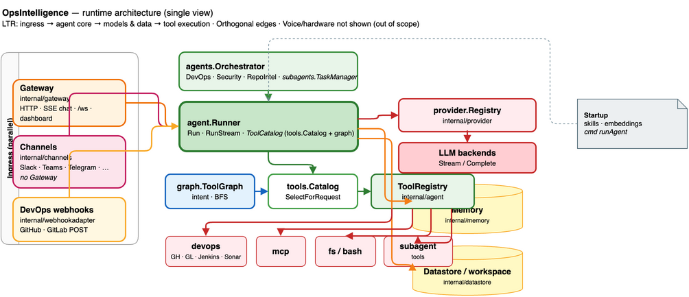

<h1 align="center">OpsIntelligence</h1>

<p align="center">
  <strong>DevOps judgment, on a loop — with your policies wired in.</strong><br>
  <em>PR review · CI signals · Sonar triage · incidents · runbooks · optional deep repo memory.</em>
</p>

<p align="center">
  
  
  
</p>

## The short version

| You bring | It handles |
|-----------|------------|
| Markdown under `teams/<yours>/` | PR/MR reviews that cite *your* severity and style rules |
| Tokens via env vars (`token_env:`) | GitHub, GitLab, Jenkins, Sonar — read-first, confirm-before-write |
| Optional `repo_intel` + embeddings | **Repo Intelligence**: learns a repo, builds a call graph, answers **Ask repo** search (hybrid keyword + semantic) over indexed sources |

**One line:** an autonomous agent for **in-house DevOps** — not a generic chatbot, not an auto-deploy bot. It connects to the systems you already run, respects guardrails, and escalates with evidence when something is wrong.

## Architecture

Single-page runtime view (parallel ingress → `agent.Runner` → provider, memory, datastore, and tool execution). Edit in draw.io: [`doc/architecture/opsintelligence-architecture.drawio`](doc/architecture/opsintelligence-architecture.drawio). Exports (SVG/PDF with embedded diagram) live in the same folder. For tabbed flows and extra detail, see [`architecture-overview.drawio`](architecture-overview.drawio) at the repo root.

<p align="center">
  
</p>

## What this is

OpsIntelligence watches the boring-but-risky layer of engineering work:

- **Pull / merge requests** — review against team policy, flag risks, suggest fixes.
- **CI** — follow `main` (and friends), spot real regressions, treat flakes with skepticism.
- **SonarQube / SonarCloud** — quality gates, issues, hotspots: block vs. flag vs. ignore per your rules.
- **Incidents** — help on-call triage, summarize signals, draft postmortem scaffolding.
- **Runbooks** — execute step-by-step with a human in the loop.

Everything is **team-configurable**: drop Markdown policy files into `teams/<your-team>/` and the agent follows *your* bar for “ship” vs. “hold”.

### Repo Intelligence (optional, but powerful)

When you enable **`repo_intel`** in config (GitHub PAT, memory dir, optional embedder), you can **register repositories** (`opsintelligence repos add …`, or the dashboard). Each **sync**:

1. Fetches a bounded snapshot of the tree for LLM analysis and artifacts.  
2. Builds a **call graph** and symbol index.  
3. Optionally indexes a **large slice of the repo** into a hybrid store (FTS + vectors) for **scoped search** and agent RAG.

The dashboard exposes **Scan**, **Index memory**, **Call graph**, and **Ask repo** (natural language / keyword search over that index). Very large GitHub trees may return `truncated: true`; the UI and API surface a warning so you know search may be partial.

## What this is not

- **Not a deploy robot.** Default posture is **read-only** on GitHub, GitLab, Jenkins, Sonar, and MCP-backed tools. Writes need explicit human confirmation in-turn. Posting a **PR comment** is available when `devops.github` is configured with a PAT that allows it.
- **Not a consumer assistant.** Scope is DevOps workflows, integrations, and operator-controlled policy.

**Channels:** production docs and defaults center on **Slack** plus the **REST/WebSocket gateway** (apps, internal tools, dashboard). The example config still shows **commented stubs** for other adapters; enable only what your security team approves.

## Relationship to AssistClaw

OpsIntelligence is a hard fork of [AssistClaw](https://github.com/hridesh-net/AssistClaw). It keeps the agent loop, tiered memory, lazy skill graph, tools, MCP, cron, webhooks, guardrails, and extensions — and replaces consumer-centric defaults with a first-class **`devops.*`** surface and **team-aware** Markdown rules.

## Built-in integrations

| Platform | Status | What it reads |
|---|---|---|
| **GitHub** (cloud & Enterprise) | first-class | PRs, diffs, Actions runs, combined status |
| **GitLab** (cloud & self-hosted) | first-class | MRs, pipelines, jobs |
| **Jenkins** | first-class | jobs, builds, queue status |
| **SonarQube / SonarCloud** | first-class | quality gates, issues, hotspots |
| **Slack** | first-class | inbound + outbound messaging |
| **Everything else** (PagerDuty, Datadog, Sentry, Jira, …) | via **MCP** | plug in any MCP server |

Every integration stays **off** until you add a token. Tokens live in **environment variables** referenced from YAML (`token_env:`) — never committed in config files.

## Install

**One-liner (recommended — pulls the latest release binary):**

```bash
curl -fsSL https://raw.githubusercontent.com/hridesh-net/OpsIntelligence/main/install.sh | bash
```

**Pin a specific version:**

```bash
OPSINTELLIGENCE_VERSION=v0.3.50 bash install.sh
```

**Build from source** (Go version must satisfy `go.mod`, currently **1.26+**):

```bash
git clone https://github.com/hridesh-net/OpsIntelligence.git
cd OpsIntelligence
FORCE_BUILD=1 bash install.sh
```

The installer installs `opsintelligence` to `/usr/local/bin` (or `~/.local/bin`), scaffolds `~/.opsintelligence/`, and can register a login service so the gateway starts after sign-in. Use `SKIP_SERVICE=1` to skip that.

### Locked-down or client machines

1. Prefer a **tagged GitHub release** artifact: [Releases](https://github.com/hridesh-net/OpsIntelligence/releases). Pin with `OPSINTELLIGENCE_VERSION=v0.3.50 bash install.sh` (adjust tag as needed).
2. To forbid surprise downloads (clone, go.dev bootstrap, GGUF): set `NO_SOURCE_FALLBACK=1` and `OPSINTELLIGENCE_SKIP_GO_BOOTSTRAP=1` — install succeeds only if the binary (or a local Go toolchain) is already usable.
3. **Airgap / IT mirror:** copy `opsintelligence` + optional `skills/` from a machine that can reach GitHub, `chmod +x`, point `STATE_DIR` — the shell installer is optional.

Common environment toggles:

| Variable | Default | What it does |
|---|---|---|
| `OPSINTELLIGENCE_VERSION` | `latest` | Release tag to install |
| `INSTALL_DIR` | `/usr/local/bin` | Where the binary lands |
| `STATE_DIR` | `~/.opsintelligence` | Config + datastore root |
| `FORCE_BUILD=1` | — | Build from source even when a release binary exists |
| `NO_SOURCE_FALLBACK=1` | — | No automatic source build when the release asset 404s |
| `OPSINTELLIGENCE_SKIP_GO_BOOTSTRAP=1` | — | Do not download Go from go.dev when building from source |
| `OPSINTELLIGENCE_BOOTSTRAP_GO_VERSION` | `1.26.2` | Bootstrap Go version (must satisfy `go.mod`) |
| `SKIP_VENV=1` | — | Skip Python venv for the tool sandbox |
| `SKIP_SERVICE=1` | — | Skip launchd/systemd registration |
| `WITH_MEMPALACE=1` | — | Bootstrap managed MemPalace after install |
| `WITH_GEMMA=1` | — | Download the default Gemma GGUF for local-intel |

> **Release binaries.** If GitHub returns `404` for an asset, the installer may **fall back to a source build** unless you set `NO_SOURCE_FALLBACK=1`. Without Go on `PATH`, it can **bootstrap Go from go.dev** once (then delete it) unless `OPSINTELLIGENCE_SKIP_GO_BOOTSTRAP=1`.
>
> **Gemma / local-intel.** GitHub caps release assets at **2 GiB**; the default Q4_K_M GGUF is larger, so releases ship **`gemma-4-e2b-it-MIRROR_MANIFEST.txt`** (Hugging Face URLs). Onboard / `local-intel setup` pull from those mirrors. Override with **`OPSINTELLIGENCE_LOCAL_GEMMA_GGUF_URL`** or **`--url`**.
>
> **Linux arm64** release binaries are built with **`fts5` only** (no in-process Gemma on musl cross-builds). Use cloud LLMs, or build on-device with glibc and **`EXTRA_TAGS=opsintelligence_localgemma`** if you need embedded Gemma there.

**Uninstall:**

```bash
bash uninstall.sh                      # remove binary + service, keep state
bash uninstall.sh --purge              # remove everything incl. ops.db
bash uninstall.sh --purge --keep-datastore  # wipe state but preserve users/RBAC
```

`--keep-datastore` helps when moving hosts: users, roles, API keys, and audit data stay for the next install.

## Quick start

```bash
# 1. Install (see above) or build locally:
make build    # -> ./bin/opsintelligence

# 2. Onboard (writes ~/.opsintelligence/opsintelligence.yaml)
./bin/opsintelligence onboard

# 3. Seed the example team policies
./bin/opsintelligence init    # drops teams/example-team/ templates into state

# 4. Validate config and reachability
./bin/opsintelligence doctor

# 5. Run the daemon (Slack + gateway + cron + webhooks)
./bin/opsintelligence start
```

Onboarding collects: one LLM provider key, optional Slack tokens, optional GitHub / GitLab / Jenkins / Sonar tokens, and the active team name. Advanced options (memory, MCP, cron, webhooks, **repo_intel**) live in YAML or the dashboard.

See [`.opsintelligence.yaml.example`](.opsintelligence.yaml.example) for the full commented reference.

## Dashboard

With the gateway up:

```
http://127.0.0.1:18790/dashboard/
```

First visit creates the **owner** account (datastore + RBAC). After that you get:

- **Overview** — tasks, recent activity, health.
- **Tasks** — live SSE stream and transcripts.
- **Users & roles** — invites, roles (`owner`, `admin`, `operator`, …), guarded deletes. API: `/api/v1/users`, `/api/v1/roles`. Details: [`doc/users-apikeys-api.md`](doc/users-apikeys-api.md).
- **API keys** — mint with scopes and expiry; plaintext `opi_<keyid>_<secret>` shown once. API: `/api/v1/apikeys`.
- **Settings** — gateway (bind, TLS), auth/OIDC, datastore, LLM providers, MCP, channels, webhooks, agent + DevOps guardrails, **Repo Intelligence** (index limits, call-graph policy, embeddings). Edits use **`If-Match`** optimistic concurrency.
- **Repo Intel** (when configured) — per-repo scan results, learned memory, **call graph**, and **Ask repo** search over the hybrid index.

For remote access: set `gateway.bind` to `lan` or `0.0.0.0`, add TLS certs, optionally OIDC — all from Settings once an owner exists.

CLI mirror for repos: `opsintelligence repos list | add | sync | status | users | tui`.

## Configuring a team

A **team** is a folder of Markdown files merged into the agent’s system prompt on startup:

```
~/.opsintelligence/teams/platform/
├── README.md
├── pr-review.md          # severity, size limits, merge bar
├── sonar.md              # quality gates, false-positive policy
├── cicd.md               # required pipelines, flakes, rollback
├── secrets-and-safety.md # PII, tokens, approvals
└── runbooks/             # optional operator runbooks
```

Start from [`teams/example-team/`](teams/example-team/), copy, rename, edit. The agent should cite which policy drove a recommendation.

## DevOps skill graph

Shipped under [`skills/devops/`](skills/devops/) — lazy-loaded when needed:

- [`SKILL.md`](skills/devops/SKILL.md) — map of the graph.
- [`pr-review.md`](skills/devops/pr-review.md), [`sonar.md`](skills/devops/sonar.md), [`cicd.md`](skills/devops/cicd.md), [`incidents.md`](skills/devops/incidents.md), [`runbooks.md`](skills/devops/runbooks.md).

Copy to `~/.opsintelligence/skills/devops/` or point `agent.skills_dir` at the repo during dev. Invoke nodes with `read_skill_node("devops", "<node>")`.

There is also [`gh-pr-review`](skills/gh-pr-review/SKILL.md) for a strict GitHub review flow (checkout, local lint/test, line comments, suggestions).

## Smart prompts & chains

Complex DevOps answers use **named chains** (gather → analyze → critique → render) exposed via the `chain_run` tool. See [doc/smart-prompts.md](doc/smart-prompts.md).

```bash
opsintelligence prompts ls
opsintelligence prompts show pr-review
opsintelligence prompts run pr-review --input pr_url=https://…
```

Shipped chains include `pr-review`, `sonar-triage`, `cicd-regression`, `incident-scribe`. Override any prompt file under `~/.opsintelligence/prompts/<id>.md`.

## Safety posture

- **Read-first** integrations; writes need explicit human confirmation in the same conversation turn where relevant.
- **Operator-owned policy files** on disk (`POLICIES.md`, `RULES.md`, `policies/`) cannot be edited by the agent through file tools.
- **Secrets in env vars**, not YAML; `doctor` checks referenced vars before start.
- **PII-aware summaries** — minimize verbatim quoting from CI logs or diffs; never echo secrets seen in content.

## Commands

```bash
opsintelligence onboard     # Interactive setup
opsintelligence init        # State dir + seed templates
opsintelligence doctor      # Config + reachability
opsintelligence start       # Daemon
opsintelligence run "..."   # One-shot agent turn
opsintelligence repos …     # Repo Intelligence (add, list, sync, tui, …)
opsintelligence skills ls
opsintelligence tools ls    # includes devops.*
opsintelligence prompts ls | run <chain> --input key=value
```

Run `opsintelligence <cmd> --help` for flags.

## Development

```bash
make build    # go build -tags fts5 ./cmd/opsintelligence
make test     # go test ./...
make lint     # gofmt + go vet
./bin/opsintelligence doctor --config .opsintelligence.yaml.example --skip-network
```

`go test ./internal/devops/...` hits GitHub, GitLab, Jenkins, and Sonar clients against `httptest` fixtures (no live APIs).

## License

MIT — see [LICENSE](LICENSE).
