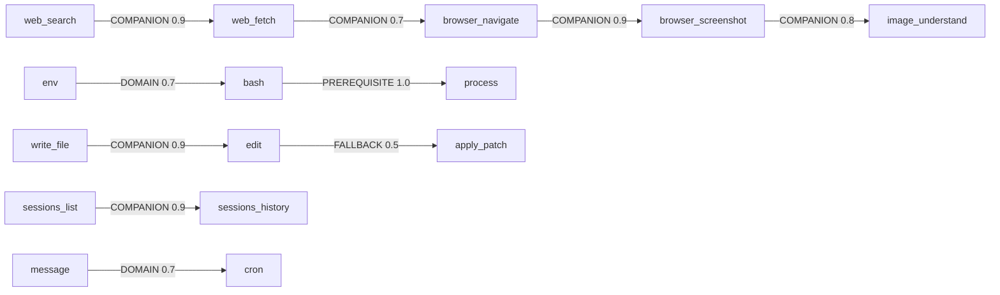
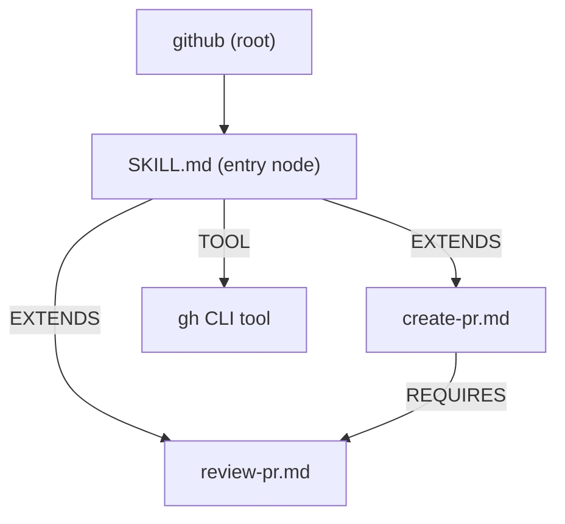

# Deep Dive: Graph-First Context Engineering

> *The context window is RAM. Fill it with only what the current task needs.*

OpsIntelligence's context engineering system addresses a fundamental problem: as you add more tools and skills, the system prompt grows, costs increase, and model attention degrades. The solution is a **graph-first, session-aware, provider-agnostic** approach to deciding what gets loaded — and when.

---

## The Problem: Context Bloat

| Source | Tokens (naïve approach) |
|--------|------------------------|
| 21 tool schemas (JSON) | ~900 |
| System prompt tool table | ~300 |
| 5 active skills × all node summaries | ~800 |
| Lessons from memory | ~200 |
| **Total overhead per turn** | **~2,200** |

Research from Anthropic's internal benchmarks shows that sending 100+ tools degrades model performance and costs 56% more tokens than a filtered approach. Context "rot" — where model quality degrades as the window fills — compounds over long sessions.

---

## The Solution: 3-Tier Context System

```
Tier 1 — ALWAYS ON
  8 core tools (guaranteed every turn) + find_tools + read_skill_node
  Skill index: skill names + one-line descriptions only (~80 tokens)

Tier 2 — GRAPH-MATCHED (per request)
  Tool graph BFS from intent-matched seed tools
  Session inertia boost for recently used tools
  Up to ~5 additional tools added to the request

Tier 3 — ON-DEMAND (agent calls a discovery tool)
  find_tools(query) → full schema for any tool
  read_skill_node(skill, node) → full node body + edge list
```

**Target token overhead: ~400–600 tokens** (down from ~2,200).

---

## Tool Graph

Every tool is a **node** in a directed weighted graph. Edges encode capability relationships:



### Edge Types

| Type | Weight | Meaning |
|------|--------|---------|
| `PREREQUISITE` | 1.0 | Almost always needed before the target |
| `COMPANION` | 0.7–0.9 | Commonly used together |
| `DOMAIN` | 0.7 | Same capability category |
| `FALLBACK` | 0.5 | Alternative if the primary fails |

### Graph Traversal

```
User message: "search for the latest Go 1.24 release notes"
        │
  Intent classifier (keyword match, no embeddings)
  → Intent: WEB_RESEARCH
  → Seed nodes: [web_search, web_fetch]
        │
  BFS from seeds (Tool Graph)
  web_search → web_fetch (COMPANION 0.9)
  web_fetch  → browser_navigate (COMPANION 0.7)
        │
  Session inertia check
  (web_search used last turn → web_fetch gets +0.3 boost)
        │
  Top 5 selected: web_search, web_fetch, bash, browser_navigate, read_file
  + Core 8 always-on
  = 10–12 tools sent to LLM (was 21)
```

### Session Inertia

Each time the agent calls a tool, its outgoing neighbours get a **+0.3 weight boost** for the next turn (decays linearly). This mirrors the "tool usage inertia" principle from the AutoTool paper (2025): tool invocations follow predictable sequential patterns — if you searched the web once, you will likely fetch a URL next.

```
Turn 1: agent calls web_search
Turn 2: web_fetch gets +0.3 → rises to top of selection automatically
Turn 3: boost decays → web_fetch still slightly elevated
```

---

## Skill Graph

Skills are also a graph. Each skill is a **root node**; each `.md` file is a **child node**; `[[wikilinks]]` in body text become **directed edges**.



### Edge Types in Skill Graphs

| Type | Source | How Set |
|------|--------|---------|
| `ENTRY` | skill root → SKILL.md | Automatic |
| `EXTENDS` | SKILL.md → sub-node | `[[wikilink]]` in body |
| `REQUIRES` | node → prerequisite | `requires: [node]` in frontmatter |
| `EXAMPLE` | node → example file | `examples: [node]` in frontmatter |
| `TOOL` | node → skill-defined tool | `tools:` block in SKILL.md |

### What the Agent Sees (System Prompt — ~80 tokens)

```
## Skills Available
Call skill_graph_index() for the full node index, or read_skill_node(skill, node) directly.
Active: github (PR management), notion (notes), slack (messaging)
```

### What the Agent Reads On Demand

```
Agent: skill_graph_index()
→ github: [[SKILL]], [[create-pr]], [[review-pr]]
   notion: [[SKILL]], [[create-page]]

Agent: read_skill_node("github", "create-pr")
→ Full body of create-pr.md
  Links in this node:
    [[review-pr]] — Review and comment on a pull request
    Call read_skill_node("github", "review-pr") to follow.
```

Only the nodes the agent actually needs get loaded. All others stay off-disk.

---

## Intent Classification

No embedding model required. Intent is classified by keyword matching against a fixed vocabulary:

```
WEB_RESEARCH  → search, find, look up, latest, current, online, research
FILE_OPS      → create, write, edit, modify, read, file, contents
CODE_EXEC     → run, execute, test, build, compile, install, npm, go, pip
BROWSER       → screenshot, navigate, browser, page, click, url, open
MEMORY        → remember, history, session, past, previous
SCHEDULE      → schedule, recurring, daily, cron, every, repeat
COMMUNICATE   → send, message, notify, alert, telegram, whatsapp, slack
SYSTEM        → process, background, daemon, env, environment, variable
```

Multiple intents can match simultaneously → BFS is seeded from ALL matching tools in parallel.

---

## Provider Compatibility

The system detects what the LLM provider supports and adapts:

| Provider | Schema Delivery | Strategy |
|----------|----------------|----------|
| Anthropic Claude | Optional subset | Graph-selected subset per request |
| OpenAI GPT-4/4o | Optional subset | Graph-selected subset per request |
| AWS Bedrock | All tools required upfront | Send all; system prompt scopes attention |
| Ollama / local models | Varies by model | Text-based `find_tools` fallback |
| Google Gemini | Optional subset | Graph-selected subset per request |
| Unknown | Unknown | 10 core + `find_tools` |

For providers that require all tools upfront (Bedrock), the system prompt includes:
> *"Focus only on tools relevant to your current task. Use `find_tools` if you are unsure which tool is appropriate."*

---

## The `find_tools` Tool

Even when the LLM can't call unknown tool schemas, it can always call `find_tools`:

```json
{ "tool": "find_tools", "input": { "query": "how do I schedule a recurring job?" } }
```

Returns **plain text** — no JSON schema, no provider type-system issues:

```
Matched tools:
• cron     — Schedule recurring commands (cron expressions). Usage: cron(action, schedule, command)
• bash     — Run any shell command.
• process  — Manage background processes.

Related skills: none active match this query.
Tip: call find_tools(tool_name="cron") for the full schema.
```

Works with any LLM that can produce text output — including models without native tool-use support.

---

## Token Budget (Before vs After)

| Piece | Before | After |
|-------|--------|-------|
| Tool schemas in API request | 21 × ~50 = 1,050 | 8–13 × ~50 = 550 |
| System prompt tool table | ~300 | ~100 (core 8) |
| Skill context | ~800 | ~80 (3-line header) |
| **Total overhead** | **~2,150** | **~730** |
| **Reduction** | — | **~66%** |

---

## Implementation Reference

| File | Role |
|------|------|
| `internal/graph/tool_graph.go` | ToolGraph: nodes, edges, BFS traversal, session inertia |
| `internal/graph/skill_graph.go` | SkillGraph: nodes, typed edges, wikilink parser, index |
| `internal/tools/catalog.go` | Catalog: wraps all tools, SelectForRequest, RecordUsage |
| `internal/tools/find_tool.go` | `find_tools` agent tool — text output, any-LLM safe |
| `internal/provider/caps.go` | ProviderCaps: MaxTools, RequiresAllTools, NativeToolUse |
| `internal/skills/loader.go` | BuildContext → slim 3-line header; dynamic skill tool registration |
| `internal/skills/node_tool.go` | read_skill_node → appends wikilink edge list to output |
| `internal/skills/graph_index.go` | `skill_graph_index` agent tool |
| `internal/agent/runner.go` | buildRequestV3 → uses Catalog.SelectForRequest |

---

## Comparison with Existing Approaches

| Feature | Typical Agent Framework | OpsIntelligence Graph |
|---------|------------------------|-----------------|
| Tool selection | All tools dumped into prompt | Graph BFS + session inertia |
| Skill content | Flat files, all loaded | Graph nodes, lazy wikilink traversal |
| Session continuity | None | Tool inertia — used tools boost neighbours |
| Provider support | Often provider-locked | Capability detection + text fallback |
| Relationship encoding | Flat list | Typed directed edges (6 edge types) |
| Skill tools | Always registered | Only when skill is active |
| Requires embeddings | Often yes | No — keyword intent classification |
| Graph structure | None | Both tools AND skills are real graphs |

---

## See Also

- [Skill Graphs](skill-graphs.md) — writing and structuring skill graph files
- [Skills and Tools](skills-and-tools.md) — autonomous tool generation
- [Providers and Routing](providers-and-routing.md) — provider configuration
