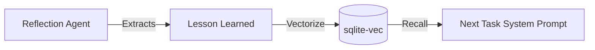

# Deep Dive: The Autonomous Execution Loop (V3)

The "brain" of OpsIntelligence is the **Runner**. Unlike a traditional chatbot that simply maps "Input -> LLM -> Output," OpsIntelligence implements a sophisticated multi-phase execution loop designed for high-accuracy reasoning and autonomous problem-solving.

---

## 🔁 The Three-Phase Cycle

The V3 engine moves away from single-turn intelligence and adopts a **Plan-Execute-Reflect** pattern.

### 1. Planning: Architectural Foresight
When a message is received, the agent doesn't jump into tools. It first requests a hidden "Plan" from the LLM. 
- **Goal**: Decompose complex user intent into manageable milestones.
- **Benefit**: Reduces "hallucination loops" where the agent keeps trying the same failing tool. By having a plan, the agent knows what "success" looks like before it starts.

### 2. Execution: The Tool-Use Loop
The agent iterates through tool calls (e.g., search, file reading, code execution).
- **Concurrency**: While the loop is sequential by nature (Step 2 often depends on Step 1), OpsIntelligence supports multi-tool dispatching if the LLM provides multiple tool calls in a single turn.
- **Context Management**: OpsIntelligence uses "Working Memory" (RAM) to track the tokens used in the current conversation, auto-compacting the history to keep the conversation within the LLM's context window.

### 3. Reflection: Self-Correction & Learning
This is the most critical differentiator from a plain chat loop. After the task is "finished," OpsIntelligence enters a reflection state.
- **Critique**: The agent evaluates: "Did I actually fulfill the user's intent?"
- **Lessons Learned**: If a mistake was made (e.g., "The search API requires quotes for exact matches"), the agent extracts a `<lesson_learned>` tag.

---

## 🧠 Corrective Memory (Semantic Feedback)

This reflection phase feeds into the **Semantic Memory Tier**.

**How it works**:
1.  A lesson is converted into a mathematical vector (embedding).
2.  In future tasks, OpsIntelligence searches this vector database for lessons relevant to the *new* query.
3.  Past mistakes are injected into the *current* system prompt as "Pro-tips" or "Things to avoid."

---

## 📚 Multi-Tier Memory Architecture

To replicate this, you must implement three distinct tiers:

1.  **Working Memory (The Context)**:
    - **Logic**: A simple list of messages in RAM.
    - **Code Role**: Filters and summarizes history before sending to the LLM.

2.  **Episodic Memory (The History)**:
    - **Logic**: Persistent storage (SQLite) with Full-Text Search (FTS5).
    - **Code Role**: Allows the user or agent to search for "that thing we talked about last month."

3.  **Semantic Memory (The Knowledge)**:
    - **Logic**: Vector database (sqlite-vec).
    - **Code Role**: Stores unstructured data and lessons learned for RAG (Retrieval-Augmented Generation).

---

## 🛠️ Replicating the Logic

If you are building a replica:
*   **Don't** just send the user message to the LLM.
*   **Do** wrap it in a `Runner` struct that manages a `while` loop.
*   **Do** implement a "Finish Reason" check to handle tool calls.
*   **Do** ensure that reflection is an *independent* call to the LLM after the primary task is done.

*This documentation is part of the OpsIntelligence blog series on Autonomous Agent Architecture.*
