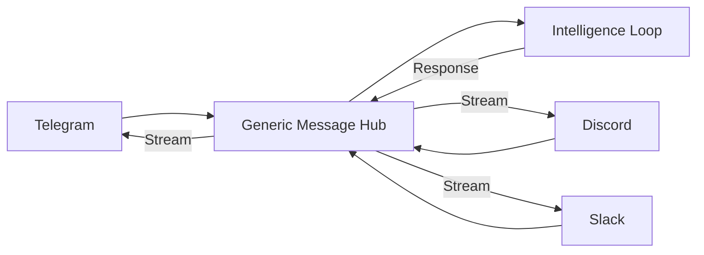

# Deep Dive: Providers, Routing & Channels

OpsIntelligence is designed to be **Model Agnostic**. It treats LLMs and Messaging Platforms as interchangeable "Slots," allowing it to run on anything from a high-end cloud model (GPT-4o) to a local, offline model (Llama 3 8B via Ollama).

---

## 🔌 The Universal Provider Adapter

In many monolithic agent codebases, adding a new AI provider means touching core logic in several places. OpsIntelligence uses a **Provider Interface** that keeps that surface small.

### The abstraction logic:
Every provider (OpenAI, Anthropic, Ollama, etc.) must implement a single Go interface. This interface handles:
- **Chat Completion**: Sending messages and receiving responses.
- **Tool Calling**: Parsing tool requests and formatting tool results.
- **Streaming**: Delivering tokens to the user as they are generated.
- **Embeddings**: Converting text into mathematical vectors for memory.

```go
type Provider interface {
    Chat(ctx context.Context, req ChatRequest) (ChatResponse, error)
    Embed(ctx context.Context, model, input string) ([]float32, error)
    ListModels(ctx context.Context) ([]ModelInfo, error)
}
```

This allows the **Runner** to interact with "An AI" without caring if it's running on Google Vertex, AWS Bedrock, or a local Pi.

---

## 🚦 Task Routing: Multi-Model Intelligence

OpsIntelligence doesn't just use one model. It can **Route** tasks to the most efficient model based on complexity.

### Routing Logic
1.  **Direct Routing**: You can force a model per message using `--model provider/name`.
2.  **Fallback Routing**: If your primary provider (e.g., Anthropic) is down or hits a rate limit, the system can automatically fall back to a local backup (Ollama).
3.  **Cost Optimization**: Future versions are designed to route "easy" tasks (like summarization) to cheaper models and "hard" tasks (like coding) to premium models.

---

## 📱 The Unified Channel Architecture

How does the agent talk to Telegram, Discord, and Slack simultaneously? It uses a **Unified Message Format**.

### The Workflow
1.  **Ingestion**: A channel (e.g., Telegram) receives a message and converts its platform-specific data into a generic `channels.Message` struct.
2.  **Session ID**: Every channel generates a unique `SessionID` (e.g., `tg:username` or `discord:channel_id`). This allows the agent to maintain separate memories for different people on different apps.
3.  **The Runner**: Processes the message using the intelligence loop.
4.  **Streaming Response**: The agent passes a `ReplyFn` callback to the channel. This allows the agent to "stream" its thoughts back to the chat app in real-time.



---

## 🏗️ Replicating the Connectivity

To replicate this multi-platform connectivity:

1.  **Define a Generic Message**: Create a structure that has `Text`, `SessionID`, and `ChannelID`.
2.  **Avoid Direct API Usage**: Don't sprinkle Telegram-specific code throughout your agent logic. Keep it isolated in its own "driver" or "adapter" file.
3.  **Standardize Authentication**: Use a registry to store API keys and tokens so you can initialize all channels in a single loop during startup.
4.  **Implement Streaming**: Even if the chat platform doesn't strictly support token-by-token streaming (like Discord), implement a buffer that "edits" or "sends" message chunks periodically to improve User Experience.

*This documentation is part of the OpsIntelligence blog series on Autonomous Agent Architecture.*
