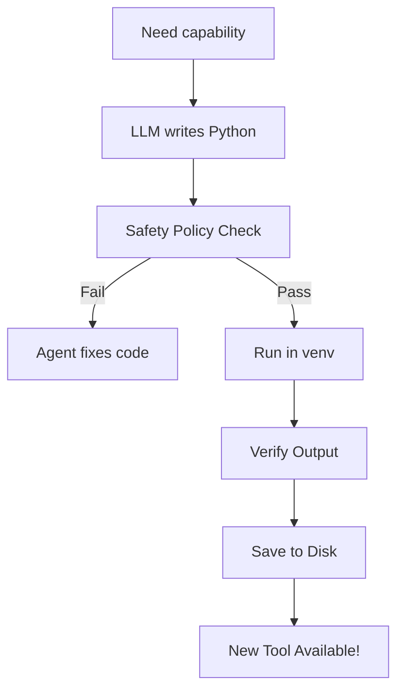

# Deep Dive: Dynamic Skills & Autonomous Tools

A major innovation in OpsIntelligence is the ability to expand its brain (Skills) and its capabilities (Tools) dynamically without recompiling the core Go engine. This makes the system "infinite" in its potential.

---

## 🛠️ The Skills Mechanism (`SKILL.md`)

In OpsIntelligence, a "Skill" is a high-level package of domain knowledge and specialized tools. It is defined by a simple Markdown file: `SKILL.md`.

### Anatomy of a Skill
```yaml
---
name: "Web Searching"
description: "Allows the agent to browse the live web."
opsintelligence:
  emoji: "🌐"
  requires:
    bins: ["python3", "pip"]
  install:
    - label: "Install BeautifulSoup"
      kind: "pip"
      package: "beautifulsoup4"
---
# Instructions
Always search for the latest news before answering...
```

### How it's Loaded
1.  **Discovery**: The `Registry` scans directories for `SKILL.md` files.
2.  **Validation**: It checks if required "bins" (binaries like Python or FFmpeg) exist on the host system.
3.  **Prompt Injection**: The `Instructions` section is dynamically appended to the agent's System Prompt inside a `<skill>` tag.
4.  **Auto-Installation**: If a skill is missing dependencies, the onboarding wizard can proactively run `brew`, `apt`, or `pip` to fix it.

---

## 🤖 Autonomous Tool Generation

While OpsIntelligence has "Static Tools" (Go code), its real power lies in **Autonomous Tools**. If the agent realizes it lacks a capability, it can *program itself*.

### The Workflow
1.  **Drafting**: The LLM writes a Python script to solve a specific problem (e.g., "Calculate the Fibonacci sequence for n=10,000 using decimals").
2.  **Safety Validation**: OpsIntelligence runs the script through a **Safety Policy**. It blocks forbidden patterns like `os.system`, `eval`, or access to sensitive paths like `/etc/passwd`.
3.  **Sandbox Execution**: The script runs in an isolated Python Virtual Environment (`venv`) with restricted environment variables and a strict timeout.
4.  **Persistence**: If the tool works, it's saved to the `~/.opsintelligence/tools` directory as a `.py` file with a corresponding `.meta.json` schema.



---

## 🏗️ Replicating the System

To build a replica of this "Infinite Capability" system:

1.  **Standardize Prompt Injection**: Create a template system where Markdown instructions can be easily added to the LLM's start-of-session prompt.
2.  **Implement a Script Runner**: Build a module that can write a string to a temporary `.py` file and execute it using a subprocess.
3.  **Focus on Isolation**: Never run auto-generated code with the same permissions as your main application. Use `venv`, `Docker`, or at least limited environment variables.
4.  **Schema Generation**: Ensure the agent generates a JSON schema for the new tool so that future sessions know how to call it.

*This documentation is part of the OpsIntelligence blog series on Autonomous Agent Architecture.*
