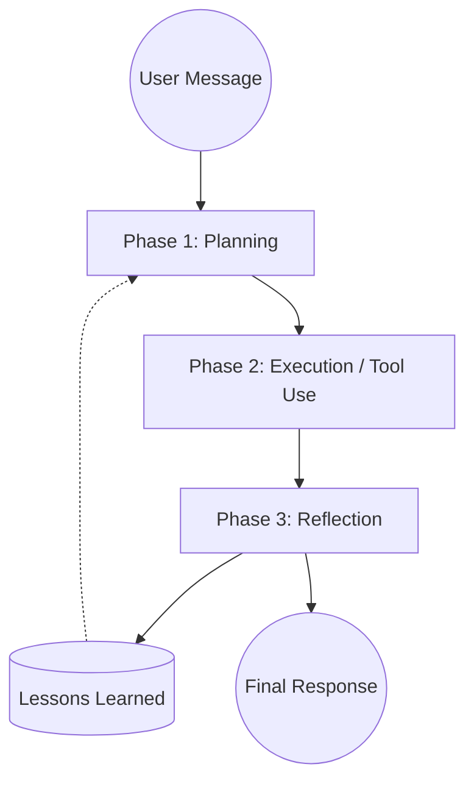

# The Master Guide: Building an Autonomous Multi-Agent AI System

Welcome to the definitive guide on the architecture, logic, and inner workings of **OpsIntelligence**. Whether you're a developer looking to contribute, a curious user, or someone wanting to replicate this system, this document breaks down the complexity into understandable principles.

---

## 🏗️ Core Principles: The Foundation

OpsIntelligence is built on four pillars that enable it to be more than just a chatbot—it’s an **Autonomous Agent**.

1.  **Autonomous Agency**: Unlike standard AI chat interfaces, OpsIntelligence doesn't just "reply." It uses a **Plan-Execute-Reflect** loop to break down complex tasks, use tools, and learn from its own mistakes.
2.  **Multi-Channel Connectivity**: It acts as a bridge. You can talk to it via Telegram, Discord, Slack, or a dedicated REST/WebSocket Gateway. One brain, many interfaces.
3.  **Tiered Memory System**: To feel "human" and context-aware, it uses three types of memory:
    *   **Working (RAM)**: Current conversation context.
    *   **Episodic (SQLite FTS5)**: Searchable history of every interaction.
    *   **Semantic (Vector Search)**: Knowledge and "Lessons Learned" stored as mathematical vectors.
4.  **Hardware & Local First**: Optimized for local execution (like Raspberry Pi), it includes a C++ sensing layer for Camera, Audio, and GPIO, making it a physical agent in your world.

---

## 🔄 The Intelligence Loop: How it "Thinks"

Every time you send a message, OpsIntelligence enters a multi-phase reasoning cycle. This is what differentiates it from simple LLM wrappers.

### The Planning Phase
The agent first analyzes your request and generates a high-level **Plan**.
> "I need to summarize this PDF, then search for related news, and finally send a report to Slack."

### The Execution Phase
It then iterates through the plan. If it needs information it doesn't have, it uses **Tools**.
*   **Built-in Tools**: Search, Browser, File Access.
*   **Autonomous Tools**: The agent can *write its own Python code* to solve niche problems on the fly.

### The Reflection Phase
After completing the task, the agent self-critiques:
*   "Did I solve the user's problem?"
*   "Did I encounter any errors?"
*   "What should I do differently next time?" (Stored as a **Lesson Learned**).

---

## 🛠️ System Architecture: The Codebase

If you look at the source code, here is how the components fit together:

### 1. The Runner (`internal/agent/runner.go`)
The "CPU" of the agent. It manages the loop, handles tool calls, and orchestrates the transition between reasoning phases.

### 2. The Memory Manager (`internal/memory/`)
Manages the SQLite and Vector databases. It ensures that when you ask, "What did we talk about last Tuesday?", it finds the answer in milliseconds using Full-Text Search.

### 3. Messaging Channels (`internal/channels/`)
Each channel implementation (WhatsApp, Telegram, etc.) is modular. They follow a simple interface:
1.  **Start**: Listen for incoming messages.
2.  **Handle**: Forward to the Runner.
3.  **Reply**: Send the agent's response back to the user.

### 4. Hardware Sensing (`internal/hardware/`)
A dedicated layer (often written in C++ for performance) that pipes sensor data (video, audio) into the brain using NDJSON (Streaming JSON).

---

## 🆚 OpsIntelligence vs. typical Node agent stacks

OpsIntelligence is a Go-native agent runtime aimed at a small footprint and strong ops ergonomics. Compared with common Node-based gateways and plugin ecosystems, it emphasizes:

| Feature | Typical Node stacks | OpsIntelligence (Go) |
| :--- | :--- | :--- |
| **Language** | Node.js (TypeScript) | Go (Golang) |
| **Memory** | Basic File History | Three-Tier (Vector + FTS5) |
| **Onboarding** | CLI Prompts | Rich TUI (huh) with Pre-population |
| **Cross-Platform** | Node Runtime required | Statically Linked Binaries (Single File) |
| **Hardware** | Web APIs | Native C++ Sensing (GPIO, OpenCV) |
| **Intelligence** | Single Turn | Plan-Execute-Reflect (V3) |

---

## 🔍 Deep Dives: Technical Inner Workings

For a more granular look at the specialized systems within OpsIntelligence, explore our technical deep-dive series:

1.  **[The Autonomous Execution Loop](deep-dives/execution-loop.md)**: Explore the Plan-Execute-Reflect cycle and how Corrective Memory (Lessons Learned) helps the agent improve over time.
2.  **[Dynamic Skills & Autonomous Tools](deep-dives/skills-and-tools.md)**: Understand the `SKILL.md` mechanism and how the agent safely writes and executes its own Python tools.
3.  **[Providers, Routing & Channels](deep-dives/providers-and-routing.md)**: Deep dive into the model-agnostic provider registry and the unified messaging channel architecture.
4.  **[Skill Graphs](deep-dives/skill-graphs.md)**: How skills are structured as navigable graphs with lazy node loading — 96% context reduction vs flat file injection.
5.  **[Context Engineering](deep-dives/context-engineering.md)**: Graph-first system for selecting which tools and skill nodes to surface per request. Covers tool graph BFS traversal, session inertia, intent classification, and provider-capability adaptation.

---

## 🚀 Building Your Own Replica

To recreate this architecture, follow these steps:
1.  **Implement a Message Bus**: A central place to handle input/output from any source.
2.  **Choose a Reasoning Pattern**: Start with a simple "System Prompt" and evolve into a multi-phase loop.
3.  **Add Persistent Storage**: Don't rely on volatile memory. Use SQLite for history and a Vector Store for long-term knowledge retrieval.
4.  **Abstract your Providers**: Wrap LLM APIs (OpenAI, Anthropic) in a common interface so you can switch models at runtime.

---

*This guide is part of the OpsIntelligence documentation suite. Join the revolution in autonomous agents at [hridesh-net/OpsIntelligence](https://github.com/hridesh-net/OpsIntelligence).*
