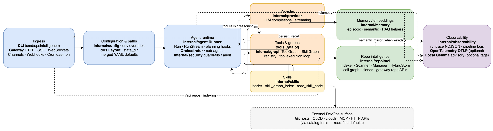
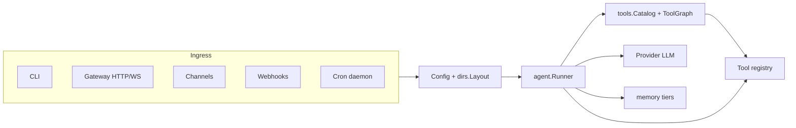

# Architecture overview

Contributor- and operator-oriented map of how the binary fits together: ingress, configuration, agent loop, and cross-cutting services.

Canonical on-disk layout lives in [`internal/dirs/layout.go`](https://github.com/hridesh-net/OpsIntelligence/blob/main/internal/dirs/layout.go) (`dirs.Layout`). Resolved defaults live in [`internal/config/config.go`](https://github.com/hridesh-net/OpsIntelligence/blob/main/internal/config/config.go) (`applyDefaults`, `applyAgentRunTrace`). When YAML field comments disagree with those implementations, trust the code.

## System diagram

- **Source:** [`diagrams/opsintelligence-architecture.drawio`](diagrams/opsintelligence-architecture.drawio) (edit in draw.io desktop). After changes, re-export the PNG using the command in [Contributing → Architecture diagram export](../contributing.md#architecture-diagram-export).

## Request path

Typical interactive flow:

1. **Ingress** — CLI, HTTP gateway (`POST /api/chat` streams SSE), WebSockets, Slack/Teams/adapters, webhooks under `/api/webhook/`, or scheduled **cron**. Each path constructs a `memory.Message` and calls `agent.Runner.Run` or `RunStream`.
2. **Config** — `state_dir`, merged YAML, env overrides; paths join under `state_dir` unless absolute.
3. **`agent.Runner`** — Builds the provider completion request (`buildRequestV3`), selects tools via `tools.Catalog`, runs the model stream, executes tool calls, persists episodic memory, repeats until no tools or max iterations.
4. **Provider / tools / memory** — LLM via `internal/provider`; tools via `internal/tools`; tiered memory via `internal/memory`.
5. **Sub-agents** — `subagent_run` and async variants spawn child runners with cloned registries ([`internal/tools/subagent.go`](https://github.com/hridesh-net/OpsIntelligence/blob/main/internal/tools/subagent.go)).

Background workers reuse the same configuration:

- **`internal/cron`** — schedules YAML `cron:` jobs; each tick clones the gateway runner template and runs `Runner.Run` on session id `cron:<job-id>` ([`internal/cron/cron.go`](https://github.com/hridesh-net/OpsIntelligence/blob/main/internal/cron/cron.go)).
- **Channels** — `internal/channels` plus adapters; outbound retries/DLQ default to `runtime/channels/dlq.ndjson` (`dirs.Layout.DLQ`).
- **Gateway** — [`internal/gateway/server.go`](https://github.com/hridesh-net/OpsIntelligence/blob/main/internal/gateway/server.go): mux, auth, dashboard mounts, repo APIs, webhooks, optional Tailscale. Chat calls `Runner.WithSession(...).RunStream`.

## Related visuals

Broader tabbed views: [`architecture-overview.drawio`](https://github.com/hridesh-net/OpsIntelligence/blob/main/architecture-overview.drawio) at the repository root.

## Where to read next

| Topic | Page |
| ----- | ---- |
| Package map | [Packages & layout](packages.md) |
| Runner, ToolGraph vs SkillGraph | [Agents & graphs](agents-and-graphs.md) |
| Disk, CPU, network | [Resources](resources.md) |
| Repo indexing pipeline | [Repo intelligence](repo-intelligence.md) |
| On-device Gemma | [Local intel](local-intel.md) |
